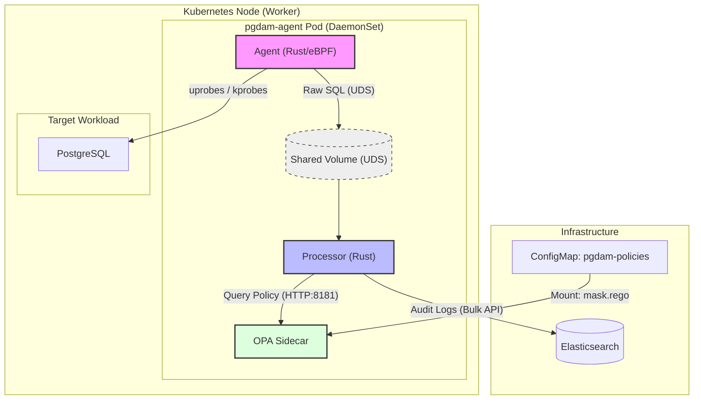

# PostgreSQL Database Activity Monitoring (pgDAM)

A high-performance PostgreSQL Database Activity Monitoring (DAM) system using eBPF for zero-overhead SQL capture and Open Policy Agent (OPA) for dynamic PII masking.

## Architecture

The system is deployed as a Kubernetes DaemonSet with three containers per pod:
1. **Agent (Rust/eBPF)**: Captures PostgreSQL network traffic using eBPF uprobes/kprobes and streams events to the Processor.
2. **Processor (Rust)**: Normalizes raw SQL, extracts potential PII, and queries OPA for masking decisions.
3. **OPA (Open Policy Agent)**: Evaluates Rego policies to determine which data points should be redacted.



## Prerequisites

- **Kubernetes Cluster**: local development using [Kind](https://kind.sigs.k8s.io/) is recommended.
- **Container Runtime**: Podman or Docker.
- **Tools**: `kind`, `kubectl`, `rustc`, `cargo`, `clang`, `llvm`.

## Development Environment Setup

To set up a local development environment, follow these steps:

### 1. Create the Kind Cluster
Use the provided configuration to create a cluster named `pgdam-dev`. This name is required by the automated build scripts.

```bash
kind create cluster --name pgdam-dev --config deploy/kind-cluster.yaml
```

> [!NOTE]
> If you are using Podman, ensure you have `KIND_EXPERIMENTAL_PROVIDER=podman` set in your environment.

### 2. Initialize Infrastructure
Create the necessary namespace and deploy the prerequisite services (Elasticsearch and a test PostgreSQL instance).

```bash
# Create namespace
kubectl apply -f deploy/namespace.yaml

# Deploy Elasticsearch (for telemetry) and Postgres (target)
kubectl apply -f deploy/elastic.yaml
kubectl apply -f deploy/postgres-dev.yaml
```

## Deployment

### 1. Build Entire Stack (Recommended)
The project includes a unified build script:
```bash
cd agent
./build.sh
```

### 2. Build Components Separately
If you prefer to build individual components, follow these steps:

#### Setup Builder Image
Ensure the shared builder image is available:
```bash
docker build -t pgdam-builder -f agent/Dockerfile.builder agent/
```

#### Build Agent
```bash
# Compile eBPF and Userspace binaries
docker run --rm -v "$(pwd):/src" pgdam-builder bash -c " \
  cargo +nightly build -Z build-std=core --manifest-path agent/pgdam-ebpf/Cargo.toml --release --target bpfel-unknown-none && \
  cargo build --manifest-path agent/pgdam-agent/Cargo.toml --release"

# Build Docker image
docker build -t pgdam-agent:latest -f agent/Dockerfile.agent agent/
```

#### Build Processor
```bash
# Compile Processor binary
docker run --rm -v "$(pwd):/src" pgdam-builder \
  cargo build --manifest-path processor/Cargo.toml --release

# Build Docker image
docker build -t pgdam-processor:latest -f processor/Dockerfile.processor processor/
```

## Deployment & Testing

Once the images are built and loaded into Kind, follow these steps to deploy and verify the solution.

### 1. Apply Policies and Deploy
Apply the RBAC configurations, OPA Rego policies, and deploy the DaemonSet.

```bash
kubectl apply -f deploy/rbac.yaml
kubectl apply -f deploy/configs.yaml
kubectl apply -f deploy/daemonset.yaml
```

### 2. Verify Deployment
Wait for the pods to be ready:

```bash
kubectl get pods -n pgdam -w
```

### 3. Execute a Query with PII
Connect to the test PostgreSQL instance and run a query containing sensitive data.

```bash
# Find the postgres pod and run psql
export PG_POD=$(kubectl get pod -l app=postgres -o jsonpath='{.items[0].metadata.name}')
kubectl exec -it $PG_POD -- psql -U postgres -c "SELECT '4111222233334444' as card_number;"
```

### 4. Verify Masking in Logs
Check the logs of the `processor` container to see the real-time masking in action.

```bash
kubectl logs -n pgdam -l app=pgdam-agent -c processor --tail=20
```

You should see an entry similar to:
```json
{
  "pid": 1234,
  "raw_sql": "SELECT '4111222233334444' as card_number;",
  "normalized_sql": "SELECT $1 as card_number;",
  "masked_sql": "SELECT <REDACTED> as card_number;"
}
```

### 4. Additional Test Steps

4.1 Port forward to local for elasticsearch:
```bash
kubectl port-forward service/elasticsearch 9200:9200 -n pgdam
```

4.2 Fire SQL queries:
```bash
kubectl exec -it postgres-f5c54d86d-v4kwl -- psql -U postgres -c "SELECT * from users where id = 4;"
kubectl exec -it postgres-f5c54d86d-v4kwl -- psql -U postgres -c "SELECT '411122223333000' as card_number;"
```

4.3 Check processor log:
```bash
kubectl logs daemonset/pgdam-agent -n pgdam -c processor --tail=10  
```

4.4 Check elasticsearch log:
```bash
curl -s -u elastic:pgdam-elastic-pass \
  -X GET "localhost:9200/pgdam-audit-*/_search?pretty"
```

## Repository Structure

/
├── .github/workflows      # CI/CD pipelines
├── /agent                 # [Rust Agent] eBPF logic & Uprobes
├── /processor             # [Processing Engine] AST Parsing & Normalization
├── /deploy                # [Deployment Agent Workspace]
│   ├── /configs.yaml      # OPA Policies
│   └── /daemonset.yaml    # K8s Deployment manifests
├── /contracts             # Protobuf/JSON schemas
└── AGENTS.md              # Global "Rules of Engagement"
