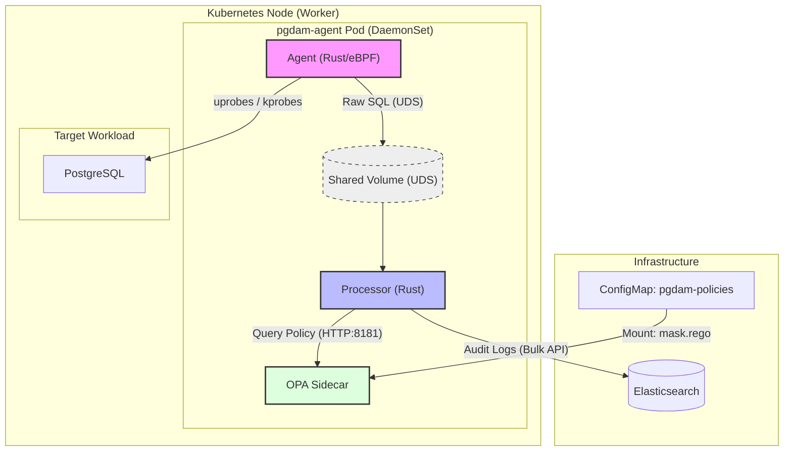

# PostgreSQL Database Activity Monitoring (pgDAM)

A high-performance PostgreSQL Database Activity Monitoring (DAM) system using eBPF for zero-overhead SQL capture, Open Policy Agent (OPA) for PII masking and SQL injection detection, and a Rust processor for enrichment and routing to audit sinks.

## Architecture

The system is deployed as a Kubernetes DaemonSet with three containers per pod:
1. **Agent (Rust/eBPF)**: Captures PostgreSQL network traffic using eBPF uprobes and streams events to the Processor.
2. **Processor (Rust)**: Normalizes raw SQL, extracts potential PII, queries OPA for masking and kill decisions, tracks sessions and transactions, enriches events with Kubernetes metadata, and routes to configured sinks.
3. **OPA (Open Policy Agent)**: Evaluates Rego policies to determine which data points should be redacted and whether a session should be terminated.



## Supported PostgreSQL Versions

| Version | Standard | EDB Advanced Server |
|---------|----------|---------------------|
| 14      | ✓        | —                   |
| 15      | ✓        | —                   |
| 16      | ✓        | —                   |
| 17      | ✓        | ✓                   |
| 18      | ✓        | ✓                   |

The agent detects each PostgreSQL binary's version automatically by scanning the binary on disk. Multiple PostgreSQL instances — different versions, different containers — are monitored simultaneously on the same node.

## Event Schema

Every captured query produces a document with the following fields:

| Field | Description |
|-------|-------------|
| `pid` | PostgreSQL backend process ID |
| `timestamp` | Capture time (nanoseconds since epoch) |
| `event_type` | `user_query`, `background_worker`, or `incomplete` |
| `user` | PostgreSQL username |
| `db` | Database name |
| `src_ip` | Client IP address |
| `raw_sql` | Original unmodified SQL |
| `normalized_sql` | SQL with literals replaced by `$1, $2, ...` |
| `masked_sql` | SQL with PII replaced by `<REDACTED>` |
| `hostname` | Node hostname |
| `container_id` | Container ID (if running in a container) |
| `container_name` | Container name |
| `k8s_pod` | Kubernetes pod name |
| `k8s_namespace` | Kubernetes namespace |
| `k8s_node` | Kubernetes node name |
| `k8s_labels` | Pod labels as key-value pairs |
| `session_id` | UUID stable for the lifetime of a PostgreSQL backend connection |
| `session_start` | Timestamp of the first query seen from this session |
| `transaction_id` | UUID for the current transaction (empty outside a transaction) |
| `transaction_state` | `autocommit`, `open`, `committed`, or `rolled_back` |
| `query_sequence` | Monotonically increasing counter within a session |
| `truncated` | `true` if the SQL exceeded the 512-byte capture buffer |
| `kill_triggered` | `true` if the kill policy fired for this query |

## Kill Mode

The processor supports three kill modes, configured via `config.yaml`:

| Mode | Behaviour |
|------|-----------|
| `disabled` | Kill policy is never evaluated. Default. |
| `manual` | Policy is evaluated. Flagged queries set `kill_triggered = true` in the audit log but no action is taken. |
| `auto` | Policy is evaluated. Flagged queries result in `SIGTERM` being sent to the PostgreSQL backend process. |

Kill decisions are made by OPA using the `pgdam.kill` policy. Out of the box the policy detects UNION-based injection, boolean injection, stacked queries, privilege escalation (`ALTER ROLE ... SUPERUSER`), and `pg_shadow` access. Trusted source IPs and trusted users are whitelisted and never killed.

## Processor Configuration

The processor is configured via a YAML file mounted at `/etc/pgdam/config.yaml` (override with `PGDAM_CONFIG` env var).

```yaml
kill_mode: manual  # disabled (default) | manual | auto

sinks:
  elasticsearch:
    enabled: true
    instances:
      - name: prod
        enabled: true
        url: http://elasticsearch.pgdam.svc.cluster.local:9200
        credentials:
          username_env: ELASTIC_USER
          password_env: ELASTIC_PASS

  kafka:
    enabled: true
    instances:
      - name: prod
        enabled: true
        brokers:
          - kafka:9092
        auth:
          mechanism: sasl_plain   # none | sasl_plain | sasl_scram256 | sasl_scram512 | mtls
          username_env: KAFKA_USER
          password_env: KAFKA_PASS
        topics:
          user_query:
            - pgdam.user-queries
          background_worker:
            - pgdam.bg-workers
```

Credentials are never stored in the config file — they are resolved from environment variables at runtime.


## Prerequisites

- **Kubernetes Cluster**: local development using [Kind](https://kind.sigs.k8s.io/) is recommended.
- **Container Runtime**: Podman or Docker.
- **Tools**: `kind`, `kubectl`, `rustc`, `cargo`, `clang`, `llvm`.

## Development Environment Setup

To set up a local development environment, follow these steps:

### 1. Create the Kind Cluster
Use the provided configuration to create a cluster named `pgdam-dev`. This name is required by the automated build scripts.

```bash
kind create cluster --name pgdam-dev --config deploy/kind-cluster.yaml
```

> [!NOTE]
> If you are using Podman, ensure you have `KIND_EXPERIMENTAL_PROVIDER=podman` set in your environment.

### 2. Initialize Infrastructure
Create the necessary namespace and deploy the prerequisite services (Elasticsearch and a test PostgreSQL instance).

```bash
# Create namespace
kubectl apply -f deploy/namespace.yaml

# Deploy Elasticsearch (for telemetry) and Postgres (target)
kubectl apply -f deploy/elastic.yaml
kubectl apply -f deploy/postgres-dev.yaml
```

## Deployment

### 1. Build Entire Stack (Recommended)
The project includes a unified build script:
```bash
cd agent
./build.sh
```

### 2. Build Components Separately
If you prefer to build individual components, follow these steps:

#### Setup Builder Image
Ensure the shared builder image is available:
```bash
docker build -t pgdam-builder -f agent/Dockerfile.builder agent/
```

#### Build Agent
```bash
# Compile eBPF and Userspace binaries
docker run --rm -v "$(pwd):/src" pgdam-builder bash -c " \
  cargo +nightly build -Z build-std=core --manifest-path agent/pgdam-ebpf/Cargo.toml --release --target bpfel-unknown-none && \
  cargo build --manifest-path agent/pgdam-agent/Cargo.toml --release"

# Build Docker image
docker build -t pgdam-agent:latest -f agent/Dockerfile.agent agent/
```

#### Build Processor
```bash
# Compile Processor binary
docker run --rm -v "$(pwd):/src" pgdam-builder \
  cargo build --manifest-path processor/Cargo.toml --release

# Build Docker image
docker build -t pgdam-processor:latest -f processor/Dockerfile.processor processor/
```

## Deployment & Testing

Once the images are built and loaded into Kind, follow these steps to deploy and verify the solution.

### 1. Apply Policies and Deploy
Apply the RBAC configurations, OPA Rego policies, and deploy the DaemonSet.

```bash
kubectl apply -f deploy/rbac.yaml
kubectl apply -f deploy/configs.yaml
kubectl apply -f deploy/pgdam-config.yaml
kubectl apply -f deploy/daemonset.yaml
```

### 2. Verify Deployment
Wait for the pods to be ready:

```bash
kubectl get pods -n pgdam -w
```

### 3. Execute a Query with PII
Connect to the test PostgreSQL instance and run a query containing sensitive data.

```bash
# Find the postgres pod and run psql
export PG_POD=$(kubectl get pod -l app=postgres -o jsonpath='{.items[0].metadata.name}')
kubectl exec -it $PG_POD -- psql -U postgres -c "SELECT '4111222233334444' as card_number;"
```

### 4. Verify Masking in Logs
Check the logs of the `processor` container to see the real-time masking in action.

```bash
kubectl logs -n pgdam -l app=pgdam-agent -c processor --tail=20
```

You should see an entry similar to:
```json
{
  "pid": 1234,
  "raw_sql": "SELECT '4111222233334444' as card_number;",
  "normalized_sql": "SELECT $1 as card_number;",
  "masked_sql": "SELECT <REDACTED> as card_number;"
}
```

### 4. Additional Test Steps

4.1 Port forward to local for elasticsearch:
```bash
kubectl port-forward service/elasticsearch 9200:9200 -n pgdam
```

4.2 Fire SQL queries:
```bash
kubectl exec -it postgres-f5c54d86d-v4kwl -- psql -U postgres -c "SELECT * from users where id = 4;"
kubectl exec -it postgres-f5c54d86d-v4kwl -- psql -U postgres -c "SELECT '411122223333000' as card_number;"
```

4.3 Check processor log:
```bash
kubectl logs daemonset/pgdam-agent -n pgdam -c processor --tail=10  
```

4.4 Check elasticsearch log:
```bash
curl -s -u elastic:pgdam-elastic-pass \
  -X GET "localhost:9200/pgdam-audit-*/_search?pretty"
```

## Metrics

Both the agent and processor expose Prometheus metrics:

| Endpoint | Port | Container |
|----------|------|-----------|
| `http://<node>:9090/metrics` | 9090 | agent |
| `http://<node>:9091/metrics` | 9091 | processor |

Key agent metrics:

| Metric | Description |
|--------|-------------|
| `pgdam_events_captured_total` | Total SQL events captured |
| `pgdam_events_dropped_total` | Events lost due to ring buffer overflow |
| `pgdam_truncated_events_total` | Events where SQL exceeded 512-byte buffer |
| `pgdam_pid_map_size` | Active PostgreSQL backends being monitored |
| `pgdam_binary_count` | Unique PostgreSQL binaries with active uprobes |

Key processor metrics:

| Metric | Description |
|--------|-------------|
| `pgdam_events_processed_total` | Events processed, by type |
| `pgdam_opa_latency_seconds` | OPA masking call latency |
| `pgdam_enrichment_latency_seconds` | K8s pod store scan latency |
| `pgdam_session_store_size` | Active sessions in the session store |
| `pgdam_kafka_errors_total` | Kafka produce errors, by instance and topic |
| `pgdam_elasticsearch_errors_total` | Elasticsearch indexing errors, by instance |

## Running Tests

### Unit tests

```bash
# Agent
cargo test --manifest-path agent/Cargo.toml -p pgdam-agent

# Processor
cargo test --manifest-path processor/Cargo.toml -p pgdam-processor
```

### E2E tests

Requires a running cluster with Elasticsearch and PostgreSQL port-forwarded.

```bash
kubectl port-forward service/elasticsearch 9200:9200 -n pgdam &
kubectl port-forward service/postgres 5432:5432 &

cd tests/e2e/
python3 -m venv .venv
source .venv/bin/activate
pip install -r requirements.txt
pytest test_pgdam.py -v
```

## Repository Structure

```bash
pgdam/
├── agent/                 # [Rust] eBPF sensor and userspace collector
├── processor/             # [Rust] SQL normalization and policy enforcement
├── policy-engine/         # [Rego] OPA policies for PII detection
├── dashboard/             # [Frontend] Visualization (Planned)
├── deploy/                # [K8s] Manifests (DaemonSet, RBAC, Prereqs)
├── contracts/             # [Schemas] Protobuf and JSON definitions
├── docs/                  # [Design] Architecture diagrams and documentation
├── tests/                 # [Testing] Integration and performance tests
├── AGENTS.md              # [Rules] Project-wide Orchestrator rules
└── README.md              # [Main] Project overview and setup guide
```